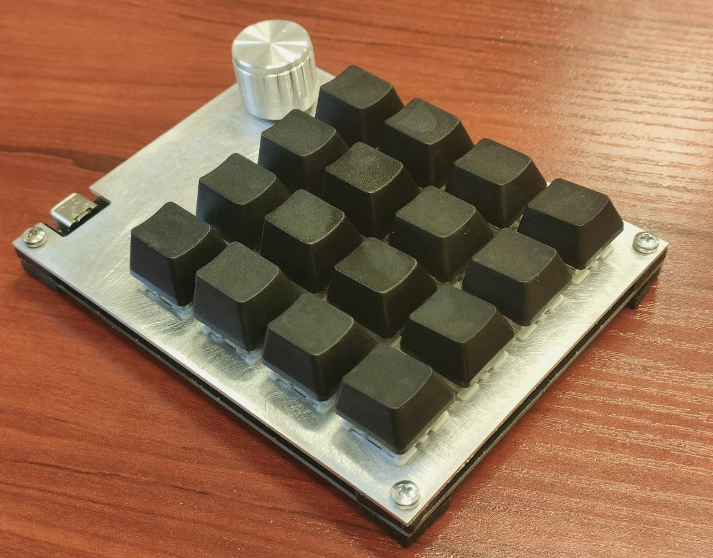
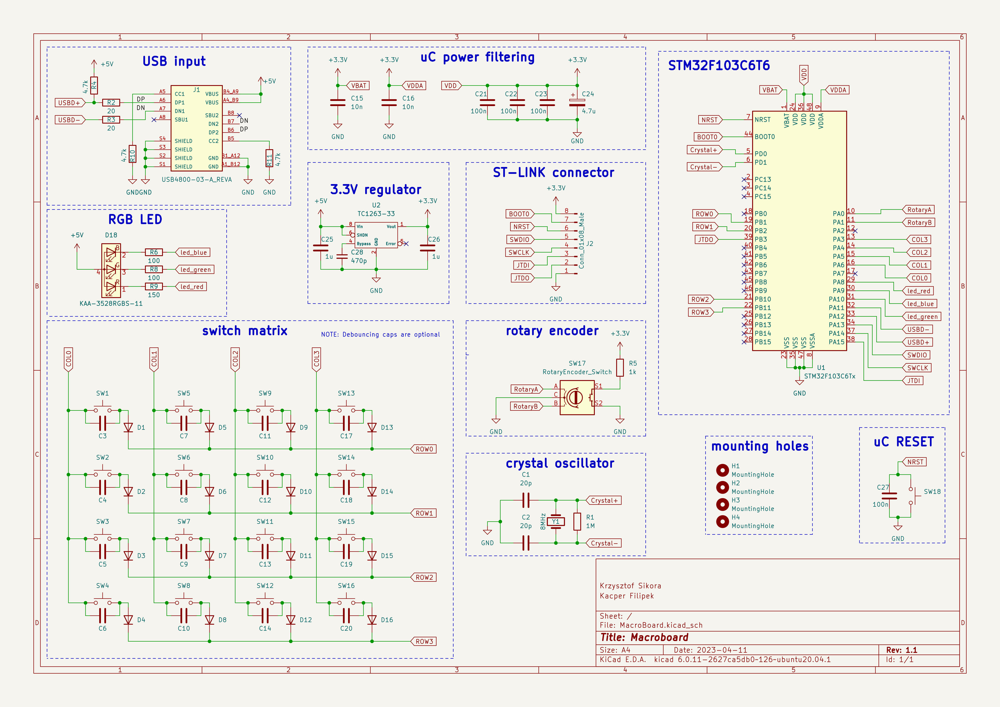
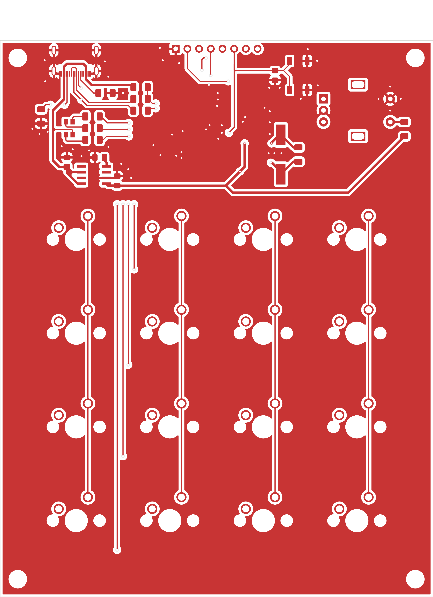
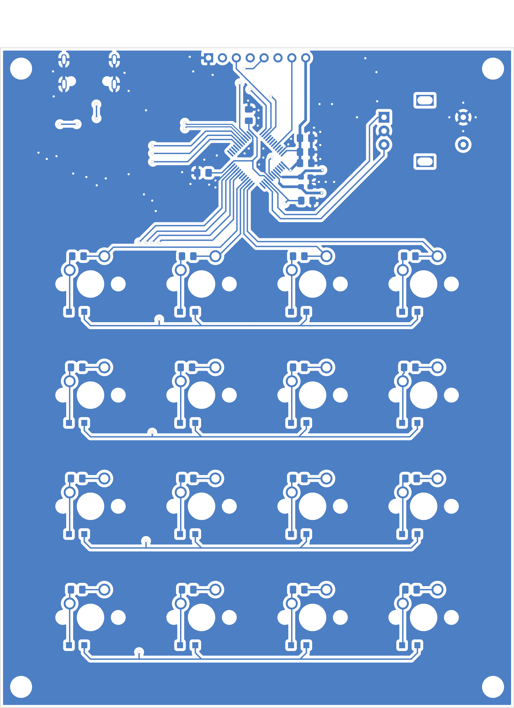
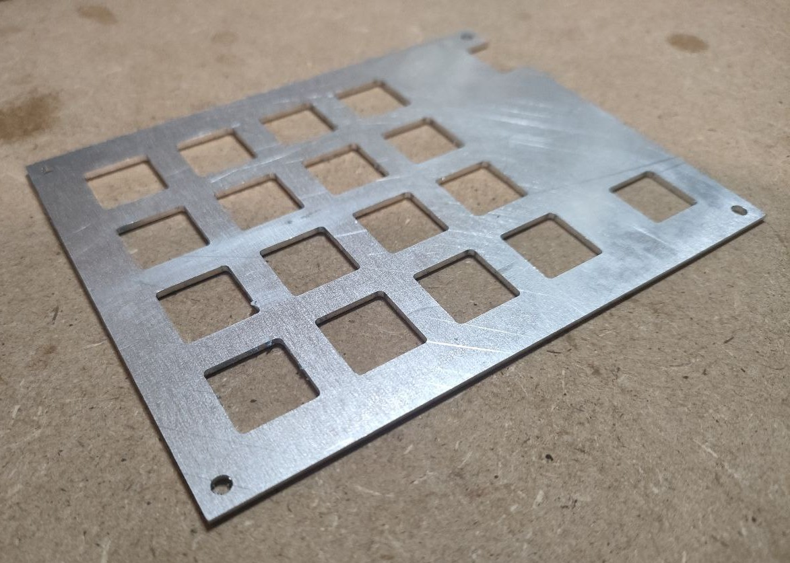

# Macroboard

Simple ortholinear 4x4 macro keyboard with rotary encoder.



## Schematics

The schematics and PCB were created using KiCAD 7. The microcontroller used is an STM32F103C6T6.



## PCB
Front | Back
:-------------------------:|:-------------------------:
 | 

## Mechanical parts

Mechanical design was done using Fusion 360. The front plate is a 1.5 mm thick aluminium plate, cut using a 3-axis CNC machine.
Standoffs for the board and plate were 3D printed with TPU.

You can find all the necessary files in the "mechanical" folder.



## Dependencies
```
arm-none-eabi-binutils
arm-none-eabi-gcc
arm-none-eabi-newlib
```

## Authors
* Kacper Filipek
* Krzysztof Sikora
